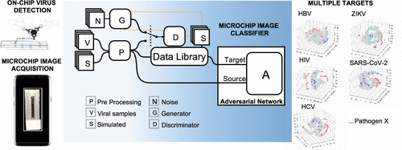
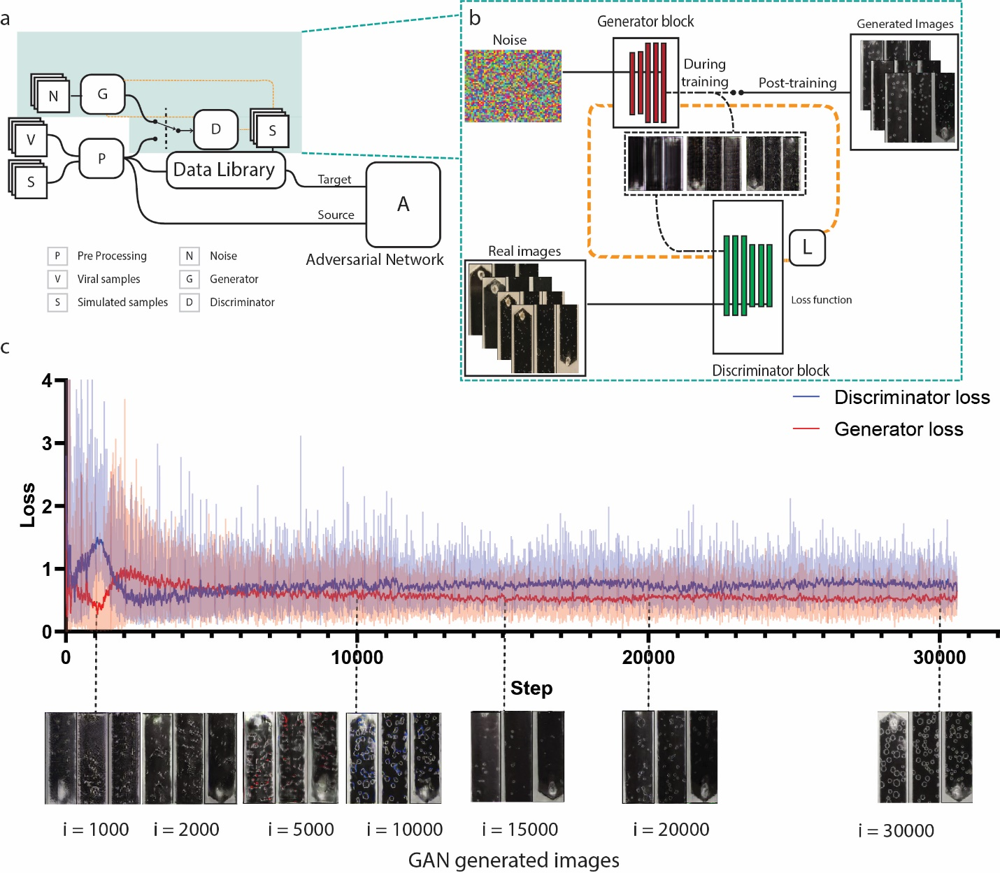
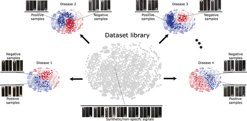
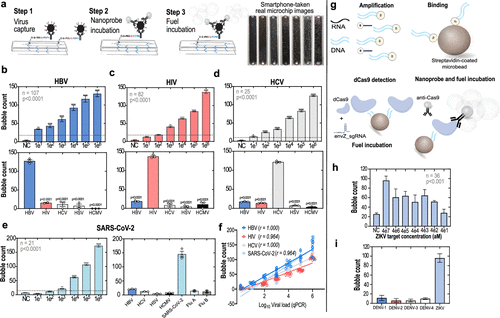
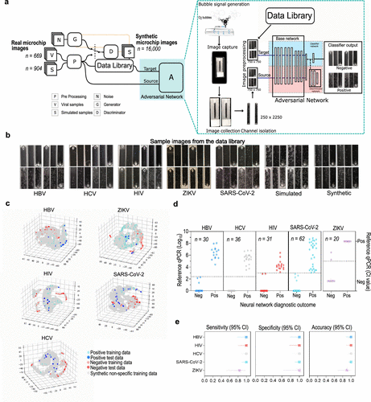

# SPyDERMAN

# [Smartphone-based Pathogen detection resource multiplier using adversarial networks (SPyDERMAN)](https://pubs.acs.org/doi/pdf/10.1021/acsnano.0c06807)

This is the Pytorch implementation for our paper [Mobile Health (mHealth) Viral Diagnostics Enabled with Adaptive Adversarial Learning](https://pubs.acs.org/doi/pdf/10.1021/acsnano.0c06807). 


### System Overview


**Abstract:**

>  Deep-learning (DL)-based image processing has potential to revolutionize the use of smartphones in mobile health (mHealth) diagnostics of infectious diseases. However, the high variability in cellphone image data acquisition and the common need for large amounts of specialist-annotated images for traditional DL model training may preclude generalizability of smartphone-based diagnostics. Here, we employed adversarial neural networks with conditioning to develop an easily reconfigurable virus diagnostic platform that leverages a dataset of smartphone-taken microfluidic chip photos to rapidly generate image classifiers for different target pathogens on-demand. Adversarial learning was also used to augment this real image dataset by generating 16,000 realistic synthetic microchip images, through style generative adversarial networks (StyleGAN). We used this platform, termed smartphone-based pathogen detection resource multiplier using adversarial networks (SPyDERMAN), to accurately detect different intact viruses in clinical samples and to detect viral nucleic acids through integration with CRISPR diagnostics. We evaluated the performance of the system in detecting five different virus targets using 179 patient samples. The generalizability of the system was confirmed by rapid reconfiguration to detect SARS-CoV-2 antigens in nasal swab samples (n = 62) with 100% accuracy. Overall, the SPyDERMAN system may contribute to epidemic preparedness strategies by providing a platform for smartphone-based diagnostics that can be adapted to a given emerging viral agent within days of work.


## Requirements
- Python 3.5
- Pytorch 1.4.0
- PyYAML 5.3.1
- scikit-image 0.14.0
- scikit-learn 0.20.0
- SciPy 1.1.0
- opencv-python 4.2.0.34
- Matplotlib 3.0.0
- NumPy 1.15.2
- TensorFlow 1.10.0 (For TensorBoard)

## Framework

### Microchip image database generation with StyleGAN 


### Dataset Library 



### Standardization of the microfluidic chip-based assays to detect intact viruses and viral nucleic acids.



### SPyDERMAN 


[comment]: <> ()

[comment]: <> (## Requirements)

[comment]: <> (```pip install requirements.txt```)

## Usage
### Generating synthetic data library:
 Run ``` python scripts/stgan.py ```


### Adversarial training with data library and target virus:

 Run ``` python scripts/train_image_.py --dset "target viral dataset location"```

 example: ``` python scripts/train_image_.py --dset "COVID19"```


<!-- # Demo 
### Source task trained from scratch:
[](https://www.youtube.com/watch?v=labaaEGMAwk)

### Target Task trained from scratch:

[](https://www.youtube.com/watch?v=_4xZucB2xFk)


### Target Task adapted from source:

[](https://www.youtube.com/watch?v=ys8d9M-L6wk)

 -->


 
## Citing 
Please cite our paper if you use our code in your research:
```
@article{shokr2020mobile,
  title={Mobile Health (mHealth) Viral Diagnostics Enabled with Adaptive Adversarial Learning},
  author={Shokr, Ahmed and Pacheco, Luis GC and Thirumalaraju, Prudhvi and Kanakasabapathy, Manoj Kumar and Gandhi, Jahnavi and Kartik, Deeksha and Silva, Filipe SR and Erdogmus, Eda and Kandula, Hemanth and Luo, Shenglin and others},
  journal={ACS nano},
  year={2020},
  publisher={ACS Publications}
}

```
## Contact
If you have any questions, please contact us via hshafiee[at]bwh.harvard.edu.